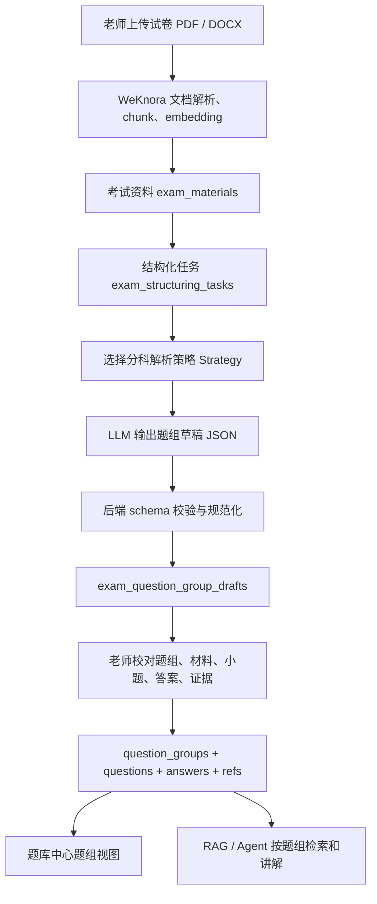

# 考试题组结构化与分科解析策略设计

## 背景

当前考试平台已经具备从知识库文档创建考试资料、发起结构化任务、调用模型抽取题目草稿、老师校对并写入题库的基础链路。这个链路可以让题库中心出现题目，但在真实试卷场景中暴露出一个核心问题：系统把题目理解成了扁平的 `Question` 列表，而不是围绕「材料 + 小题 + 答案 + 证据」组织的题组。

以高考英语阅读为例，一篇阅读材料通常对应 3 到 5 道选择题。当前抽题协议只返回 `questions[]`，导致系统把每道选择题孤立写入题库，题目列表里只剩题干、选项和答案，缺少阅读原文、篇章标题、题组顺序、证据句和来源 chunk。老师和学生看到这种题目时，无法还原真实做题场景。

数学也存在同类问题。数学题经常包含公式、图形、坐标系、几何图、分步推导和最终答案。如果只把题干文本写入 `questions.stem`，图形资产、公式结构和解题步骤会丢失，后续讲解、练习和智能体答疑都会受到影响。

因此，考试题库的底层结构需要从「扁平题目」升级为「统一题组模型 + 分科解析策略」。这个设计仍复用 WeKnora 现有文档解析、chunk、embedding 和检索链路，并吸收 RAGFlow 在文档解析、OCR、布局和可观测流水线上的思路。

## 设计目标

- 建立统一的 `QuestionGroup` 模型，用于承载阅读篇章、完形材料、数学大题、写作题干、听力片段等完整题组。
- 保留 `Question` 作为题组下的小题实体，避免一篇材料被拆成失去上下文的孤立题目。
- 为高考英语和高考数学提供第一阶段可落地的专门解析策略。
- 为高考语文、雅思 Reading、Listening、Writing、Speaking 预留清晰扩展点。
- 让题库详情页优先展示题组卡片，再展开小题、答案、解析、证据和来源。
- 兼容历史孤立题，把旧数据包装成 `single_question` 题组，不强制一次性重建全部数据。
- 保持班级空间、租户、题库和老师校对流程的权限边界不变。

## 非目标

- 不在第一阶段一次性完成所有高考科目和雅思模块的精细解析。
- 不在第一阶段替换 WeKnora 现有知识库上传、解析、chunk、embedding 和检索链路。
- 不在第一阶段实现自动批改、错题本、作业发布和学情分析。
- 不把 LLM 输出直接写入正式题库，仍保留老师校对环节。
- 不硬编码任何模型 Key、模型名称或第三方服务配置。

## 当前链路问题

### 抽题协议缺少题组层

`internal/application/service/exam_question_extractor.go` 当前要求模型返回：

```json
{
  "questions": [
    {
      "question_no": "21",
      "question_type_code": "single_choice",
      "stem": "题干",
      "options": [{ "key": "A", "content": "选项内容" }],
      "answer": { "value": "A" },
      "explanation": "解析",
      "difficulty": "unknown",
      "confidence": 0.8,
      "source_chunk_ids": ["chunk id"]
    }
  ]
}
```

这个结构适合最简单的单题，但无法表达：

- 一篇阅读原文对应多道小题。
- 完形填空的同一篇材料和多个空位。
- 数学题中的图形、公式、条件和推导过程。
- 雅思听力的音频片段、section、题号区间和材料文本。
- 小题答案与原文证据句之间的关系。

### 草稿和正式题库都以单题为根

`internal/types/exam_question_draft.go` 中的 `ExamQuestionDraftCandidate` 是扁平题目。`internal/types/exam_question.go` 中的正式表也以 `questions` 为核心，没有 `question_groups`、题组材料、题组资产和题组内小题顺序。

这会导致两个结果：

- 结构化结果在题库里看似存在，但缺少真实试卷上下文。
- RAG 检索能回答阅读原文，但题库中心无法表达同一篇阅读下的完整题组。

### 前端展示不适合真实试卷

`frontend/src/views/question-bank/QuestionBankDetail.vue` 当前使用表格展示题干、答案、难度和状态。这个视图适合扁平题目列表，但不适合展示阅读篇章、数学图形、写作材料和听力 section。

## 总体方案

采用「题组为根、分科解析、草稿校对、正式入库」的架构。



核心变化：

- 抽取阶段返回 `question_groups[]`，而不是只返回 `questions[]`。
- 题组保存材料正文、题组类型、题号范围、排序、来源 chunk、资产引用和策略元数据。
- 小题仍使用 `Question`，但新增 `group_id` 和 `order_in_group` 关联到题组。
- 草稿阶段新增 `exam_question_group_drafts`，老师先校对题组，再确认入正式题库。
- 旧 `exam_question_drafts` 可以在过渡期继续存在，但新抽题入口优先生成题组草稿。

## 数据模型草案

### `question_groups`

正式题组表，表示题库中的一个完整做题单元。

| 字段 | 类型 | 说明 |
| --- | --- | --- |
| `id` | string | 题组 ID |
| `tenant_id` | uint64 | 租户隔离 |
| `space_id` | string | 班级、个人或共享空间隔离 |
| `question_bank_id` | string | 所属题库 |
| `domain_id` | string | 考试域，例如高考、雅思 |
| `subject_id` | string | 科目或模块 |
| `group_type` | string | `reading_passage`、`math_problem`、`single_question` 等 |
| `title` | string | 题组标题，例如「阅读理解 A」 |
| `material_text` | text | 阅读原文、完形材料、写作题干或数学大题条件 |
| `material_format` | string | `plain_text`、`markdown`、`html` |
| `asset_refs` | jsonb | 图形、图片、表格、音频等资产引用 |
| `source_chunk_ids` | jsonb | 来源 chunk ID 列表 |
| `source_year` | int | 年份 |
| `source_region` | string | 地区 |
| `paper_type` | string | 试卷类型 |
| `sort_order` | int | 题库内排序 |
| `review_status` | string | 审核状态 |
| `status` | string | `draft`、`active`、`archived` |
| `created_by_user_id` | string | 创建人 |
| `created_at` / `updated_at` | time | 时间字段 |

### `questions` 扩展

正式小题仍放在 `questions` 表，但需要增加题组关联字段。

| 字段 | 类型 | 说明 |
| --- | --- | --- |
| `group_id` | string | 所属题组 ID，可为空以兼容历史数据 |
| `question_no` | string | 原卷题号，例如 `21` |
| `order_in_group` | int | 在题组中的顺序 |
| `question_metadata` | jsonb | 题型特定结构，例如空位编号、公式、评分点 |

历史孤立题在读取时包装成 `single_question` 虚拟题组；完成迁移后可为历史题补写实体题组。

### `question_group_assets`

题组资产表，用于数学图形、语文图片材料、雅思听力音频和试卷截图。

| 字段 | 类型 | 说明 |
| --- | --- | --- |
| `id` | string | 资产 ID |
| `tenant_id` | uint64 | 租户隔离 |
| `group_id` | string | 所属题组 |
| `asset_type` | string | `image`、`audio`、`table`、`formula` |
| `storage_uri` | string | 文件存储地址或对象存储 Key |
| `alt_text` | text | 无障碍描述和检索文本 |
| `source_chunk_id` | string | 来源 chunk |
| `bbox` | jsonb | 原文档中的位置信息，适配 OCR 和版面解析 |
| `metadata` | jsonb | 宽高、页码、公式 LaTeX 等扩展信息 |

第一阶段优先支持图片和公式引用；音频资产在雅思 Listening 阶段接入。

### `exam_question_group_drafts`

题组草稿表，用于承接 LLM 输出和老师校对。

| 字段 | 类型 | 说明 |
| --- | --- | --- |
| `id` | string | 草稿 ID |
| `tenant_id` | uint64 | 租户隔离 |
| `space_id` | string | 空间隔离 |
| `task_id` | string | 来源结构化任务 |
| `material_id` | string | 来源考试资料 |
| `question_bank_id` | string | 目标题库 |
| `domain_id` / `subject_id` | string | 考试域和科目 |
| `group_type` | string | 题组类型 |
| `title` | string | 题组标题 |
| `material_text` | text | 题组材料 |
| `questions_json` | jsonb | 小题数组草稿 |
| `assets_json` | jsonb | 资产数组草稿 |
| `source_chunk_ids` | jsonb | 来源 chunk |
| `strategy_code` | string | 使用的解析策略 |
| `confidence` | numeric | 题组整体置信度 |
| `status` | string | `pending_review`、`approved`、`rejected` |
| `raw_model_output` | text | 原始模型输出 |
| `error_message` | text | 校验或确认失败原因 |
| `approved_group_id` | string | 确认后的正式题组 ID |
| `reviewed_by_user_id` / `reviewed_at` | string / time | 校对人和校对时间 |

## 抽取 JSON 协议草案

新协议要求模型返回题组数组。每个题组包含材料、小题、答案、证据、资产和来源。

```json
{
  "question_groups": [
    {
      "group_no": "阅读理解A",
      "group_type": "reading_passage",
      "title": "阅读理解 A",
      "material_text": "完整阅读原文",
      "source_chunk_ids": ["chunk-1", "chunk-2"],
      "assets": [],
      "questions": [
        {
          "question_no": "21",
          "question_type_code": "single_choice",
          "stem": "What can we learn from the first paragraph?",
          "options": [
            { "key": "A", "content": "..." },
            { "key": "B", "content": "..." },
            { "key": "C", "content": "..." },
            { "key": "D", "content": "..." }
          ],
          "answer": {
            "value": "B",
            "answer_type": "option"
          },
          "explanation": "答案依据来自第二段。",
          "evidence": [
            {
              "text": "原文证据句",
              "source_chunk_id": "chunk-1"
            }
          ],
          "difficulty": "unknown",
          "confidence": 0.86,
          "order_in_group": 1
        }
      ],
      "confidence": 0.82
    }
  ]
}
```

数学题组可以使用同一协议表达图形和公式：

```json
{
  "question_groups": [
    {
      "group_no": "17",
      "group_type": "math_problem",
      "title": "第 17 题",
      "material_text": "已知函数 f(x)=x^2-2x，求...",
      "assets": [
        {
          "asset_type": "image",
          "source_chunk_id": "chunk-8",
          "alt_text": "函数图像示意图",
          "bbox": { "page": 3, "x": 120, "y": 300, "w": 260, "h": 180 }
        }
      ],
      "questions": [
        {
          "question_no": "17",
          "question_type_code": "math_solution",
          "stem": "求函数的最小值。",
          "answer": {
            "value": "-1",
            "answer_type": "text",
            "latex": "-1"
          },
          "explanation": "配方得 f(x)=(x-1)^2-1。",
          "metadata": {
            "formulas": ["f(x)=x^2-2x", "f(x)=(x-1)^2-1"],
            "solution_steps": ["配方", "确定最小值"]
          },
          "difficulty": "medium",
          "confidence": 0.78,
          "order_in_group": 1
        }
      ],
      "confidence": 0.76
    }
  ]
}
```

后端校验规则：

- `question_groups` 必须非空。
- 每个题组必须有 `group_type` 和至少 1 道小题。
- `reading_passage`、`cloze_passage`、`ielts_reading_passage` 必须有 `material_text`。
- 选择题必须至少有 2 个选项，客观题答案不能为空。
- 数学题允许没有选项，但必须有答案或解题步骤。
- `source_chunk_ids` 必须来自当前任务可访问的 chunk。
- `confidence` 统一裁剪到 0 到 1。
- 解析失败的题组记录错误，不影响其他题组草稿入库。

## 分科解析策略

### 策略接口

后端增加策略注册表，根据考试域、科目、资料类型和试卷结构选择解析策略。

```go
type ExamQuestionGroupExtractionStrategy interface {
    Code() string
    Match(material *types.ExamMaterial, task *types.ExamStructuringTask) bool
    BuildPrompt(input StrategyInput) ([]chat.Message, StrategyOptions, error)
    Parse(raw string) ([]*types.ExamQuestionGroupDraftCandidate, error)
    Validate(candidate *types.ExamQuestionGroupDraftCandidate) error
}
```

策略只负责 prompt、输出解析和学科规则校验；权限、任务状态、数据库事务和老师校对流程仍由应用服务统一处理。

### 高考英语策略

第一阶段重点支持阅读理解。

支持范围：

- 阅读理解题组：`reading_passage`。
- 单选题小题：`single_choice`。
- 原文、题号、选项、答案、解析、证据句。
- 题号连续性检查，例如 21 到 23、24 到 27。

解析原则：

- 优先完整抽取一篇阅读，而不是跨多篇材料拼凑题目。
- `material_text` 必须保留完整阅读原文。
- 每道小题的 `evidence` 尽量引用原文句子和 chunk。
- 如果答案区与试题区分离，策略应将答案 chunk 合并进同一抽取窗口。

后续扩展：

- 完形填空：`cloze_passage`。
- 七选五：`gap_filling_passage`。
- 语法填空：`grammar_fill_blank`。
- 写作：`writing_prompt`。

### 高考数学策略

第一阶段支持数学题的图文和公式基础结构，不追求完整自动解题。

支持范围：

- 单题大题：`math_problem`。
- 选择题和填空题：可包装成 `single_question` 或 `math_problem`。
- 公式 LaTeX、图形资产引用、最终答案、解题步骤摘要。
- 图形来源页码和 bbox。

解析原则：

- 文本公式优先规范化为 LaTeX，同时保留原文。
- 图片和图形不内嵌进题干，用 `assets` 引用。
- 模型无法可靠识别图形细节时，保留图片资产和 `alt_text`，由老师校对。
- 解题步骤可以为空数组，但最终答案和题干不能同时为空。

后续扩展：

- 几何题图形语义标注。
- 函数图像、统计图表和表格的结构化。
- 按知识点自动标注。

### 高考语文策略

第一阶段只定义扩展边界，不实现专门抽取。

目标题组：

- 现代文阅读：`chinese_modern_reading`。
- 文言文阅读：`classical_chinese_reading`。
- 古诗词鉴赏：`poetry_appreciation`。
- 作文：`writing_prompt`。

设计要求：

- 语文题组必须保留材料原文。
- 主观题答案使用 `answer_type=text`，允许多个参考要点。
- 解析中需要区分「参考答案」和「评分要点」。

### 雅思 Reading 策略

第一阶段只定义扩展边界，不实现专门抽取。

目标题组：

- Passage 1 / 2 / 3：`ielts_reading_passage`。
- 判断题、匹配题、填空题、选择题等小题。

设计要求：

- 题组必须保留 passage 原文。
- 小题需记录题号范围，例如 1 到 13。
- 不同题型用 `question_metadata` 表达特定结构。

### 雅思 Listening 策略

第一阶段只定义扩展边界，不实现专门抽取。

目标题组：

- Section 1 到 Section 4：`ielts_listening_section`。
- 音频、转写文本、题目和答案。

设计要求：

- 题组资产支持 `audio`。
- 题目可引用转写文本时间戳。
- 第一阶段没有音频处理链路时，只处理已有转写文本。

### 雅思 Writing 和 Speaking 策略

第一阶段只定义扩展边界，不实现专门抽取。

目标题组：

- Writing Task 1 / Task 2：`ielts_writing_prompt`。
- Speaking Part 1 / 2 / 3：`ielts_speaking_prompt`。

设计要求：

- 写作题保存 prompt、图表资产和评分维度。
- 口语题保存题目、追问和回答建议。
- 评分标准不在第一阶段实现。

## 后端流程设计

### 抽取流程

1. 老师在结构化任务中点击「开始题组抽取」。
2. 后端校验老师对班级空间和题库的写权限。
3. 后端读取考试资料、结构化任务和来源 chunk。
4. 策略注册表选择最匹配的 `Strategy`。
5. 策略构造 prompt，并要求模型返回题组 JSON。
6. 后端解析 JSON，执行通用 schema 校验和策略校验。
7. 合格题组写入 `exam_question_group_drafts`。
8. 结构化任务状态进入 `reviewing`。
9. 老师在校对页修改题组材料、小题、答案、解析、证据和资产。
10. 老师确认后，后端在事务中写入正式表。

### 正式入库事务

确认题组草稿时写入顺序如下：

1. `question_groups`：写入题组根信息。
2. `question_group_assets`：写入图片、公式、音频等资产引用。
3. `questions`：写入小题，并带上 `group_id` 和 `order_in_group`。
4. `question_options`：写入选项。
5. `question_answers`：写入答案。
6. `question_explanations`：写入解析。
7. `question_chunk_refs`：写入小题与 chunk 的引用。
8. 回写 `exam_question_group_drafts.approved_group_id`，状态改为 `approved`。

整个过程必须使用数据库事务。任何一步失败都回滚，避免题组和小题不一致。

### 兼容旧题

读取题库详情时：

- 如果存在 `question_groups`，按题组返回。
- 如果存在没有 `group_id` 的历史 `questions`，后端包装成 `single_question` 题组返回。
- 旧的扁平题目列表接口可以保留，但前端题库详情页优先使用题组接口。

## 前端展示设计

题库详情页从表格改为题组卡片。

题组卡片结构：

- 顶部：题组标题、题型、题号范围、难度、状态。
- 材料区：阅读原文、数学题干、写作 prompt 或听力转写。
- 资产区：图片、公式、表格或音频控件。
- 小题区：按 `order_in_group` 展示题干、选项、答案、解析和证据。
- 来源区：展示来源资料、chunk 和页码信息。

校对页结构：

- 左侧展示原始文档 chunk 和来源证据。
- 右侧编辑题组材料、小题、答案和解析。
- 数学题支持查看图形资产，公式以 LaTeX 和渲染结果双视图呈现。
- 老师可以退回单个题组，不影响其他题组。

学生端结构：

- 学生只能看到已确认的正式题组。
- 学生对话时可以选择知识库或题库题组作为上下文。
- 学生不能查看 `raw_model_output`、草稿错误和老师校对痕迹。

## 与 RAG 和 Agent 的关系

题组结构化不是替代 RAG，而是给 RAG 和 Agent 提供更稳定的领域索引。

- 文档解析、OCR、chunk、embedding、检索和 rerank 继续走 WeKnora 知识库链路。
- 题组抽取读取 chunk 和文档元数据，形成考试领域结构化索引。
- 对话检索时，可以同时检索原始 chunk 和题组索引。
- Agent 讲解时，可以按题组读取材料、小题、答案、解析、证据和图形资产。
- RAGFlow 的参考价值在于解析可观测性、版面元素保留、OCR 资产和检索流水线；WeKnora 的参考价值在于多租户、知识库、权限和产品化工程落地。

## 第一阶段实施范围

第一阶段只覆盖能解决当前真实问题的最小闭环：

1. 新增题组正式模型和题组草稿模型。
2. 新增题组抽取协议和后端 schema 校验。
3. 实现高考英语阅读题组策略。
4. 实现高考数学图文和公式基础策略。
5. 题库详情页改为题组卡片展示。
6. 老师校对页支持题组材料、小题、答案、解析和资产编辑。
7. 旧孤立题兼容为 `single_question` 题组。

不进入第一阶段的内容：

- 雅思听力音频处理。
- 全科目完整题型覆盖。
- 自动评分和批改。
- 复杂图形语义识别。
- 知识点自动标注。

## 验收标准

### 高考英语阅读

- 上传并解析一份高考英语试卷后，可以生成至少 1 个 `reading_passage` 题组草稿。
- 题组草稿包含完整阅读原文。
- 题组下至少包含 3 道选择题小题。
- 每道小题包含题号、题干、选项、答案、解析和来源 chunk。
- 老师确认后，题库详情页以一篇阅读材料加多道小题的形式展示。
- 对话中询问「第一篇阅读的原文和答案」时，可以从题组和 chunk 中检索到正确上下文。

### 高考数学

- 上传并解析一份包含数学题的试卷后，可以生成 `math_problem` 或 `single_question` 题组草稿。
- 公式保留原文，并尽量生成 LaTeX。
- 题目图片或图形以资产引用展示，不丢进纯文本题干。
- 老师可以在校对页查看和修改图形说明、答案和解题步骤。

### 兼容与权限

- 历史没有 `group_id` 的题目仍能在题库详情页展示。
- 学生只能查看已确认的正式题组。
- 班级空间隔离、租户隔离和题库权限不被绕过。
- 老师确认题组草稿时，正式入库过程具备事务一致性。

## 风险与控制

- **模型输出不稳定：** 使用严格 JSON 协议、schema 校验、策略校验和老师校对兜底。
- **数学图形解析不足：** 第一阶段先保存图片资产、bbox 和 alt 文本，不强行让模型理解所有几何关系。
- **数据库迁移影响旧功能：** 新增表和可空字段，旧接口保留兼容读取。
- **前端信息密度上升：** 题库详情页按题组折叠展示，默认展示材料摘要和小题数量，展开后查看完整内容。
- **检索重复来源：** 题组索引和原始 chunk 同时存在时，检索层需要区分 `group` 与 `chunk` 来源，并在回答中合并去重。

## 后续决策点

- 题组资产文件是否直接复用 WeKnora 知识库文件存储，还是为考试模块建立独立资产目录。
- 是否为 `question_groups` 建立单独向量索引，以支持按题组材料直接检索。
- 是否将 `question_types` 初始化为高考和雅思的标准题型字典。
- 语文和雅思策略的实现顺序，由真实资料上传和用户使用频率决定。

第一阶段的实现不阻塞这些决策。当前选择是先建立题组结构和英语、数学两条策略，让平台从「能抽到几道题」升级到「能表达真实试卷结构」。
